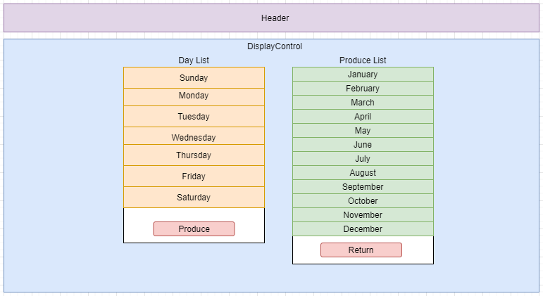

# Avery Organix
## Authored by: Michael Kriegel, Zack Rutledge, and Woo Jin Kim
### _This project was created solely for the education of the author(s) and is not in a complete or portfolio-ready state. It should not be considered representative of professional work._
---
### Description
Farmer's Market website built for Avery Organic's and their needs created in React.

---
## React Schema

---
## Available Scripts

In the project directory, you can run:

### `npm start`

Runs the app in the development mode.\
Open [http://localhost:3000](http://localhost:3000) to view it in the browser.

The page will reload if you make edits.\
You will also see any lint errors in the console.

### `npm test`

Launches the test runner in the interactive watch mode.\
See the section about [running tests](https://facebook.github.io/create-react-app/docs/running-tests) for more information.

### `npm run build`

Builds the app for production to the `build` folder.\
It correctly bundles React in production mode and optimizes the build for the best performance.

The build is minified and the filenames include the hashes.\
Your app is ready to be deployed!

See the section about [deployment](https://facebook.github.io/create-react-app/docs/deployment) for more information.

---
## Learn More

You can learn more in the [Create React App documentation](https://facebook.github.io/create-react-app/docs/getting-started).

To learn React, check out the [React documentation](https://reactjs.org/).

### Code Splitting

This section has moved here: [https://facebook.github.io/create-react-app/docs/code-splitting](https://facebook.github.io/create-react-app/docs/code-splitting)

### Analyzing the Bundle Size

This section has moved here: [https://facebook.github.io/create-react-app/docs/analyzing-the-bundle-size](https://facebook.github.io/create-react-app/docs/analyzing-the-bundle-size)

### Making a Progressive Web App

This section has moved here: [https://facebook.github.io/create-react-app/docs/making-a-progressive-web-app](https://facebook.github.io/create-react-app/docs/making-a-progressive-web-app)

### Advanced Configuration

This section has moved here: [https://facebook.github.io/create-react-app/docs/advanced-configuration](https://facebook.github.io/create-react-app/docs/advanced-configuration)

### Deployment

This section has moved here: [https://facebook.github.io/create-react-app/docs/deployment](https://facebook.github.io/create-react-app/docs/deployment)

### `npm run build` fails to minify

This section has moved here: [https://facebook.github.io/create-react-app/docs/troubleshooting#npm-run-build-fails-to-minify](https://facebook.github.io/create-react-app/docs/troubleshooting#npm-run-build-fails-to-minify)

---
## License

> [GPLv3](https://choosealicense.com/licenses/gpl-3.0/)\
> Zack Rutledge &copy; 2021\
> Michael Kriegel &copy; 2021\
> Woo Jin Kim &copy; 2021

---
## Contact Information

Reach Zack via <a href="https://www.linkedin.com/in/zack-rutledge762/" target="_blank">Linkedin</a> or <a href="thorgrim88@gmail.com" target="_blank">email</a></li>.

Reach Michael via <a href="https://www.linkedin.com/in/michael-kriegel/" target="_blank">Linkedin</a> or <a href="mikkrieg@gmail.com" target="_blank">email</a></li>.

Reach Woo Jin via <a href="https://www.linkedin.com/in//" target="_blank">Linkedin</a> or <a href="" target="_blank">email</a></li>.